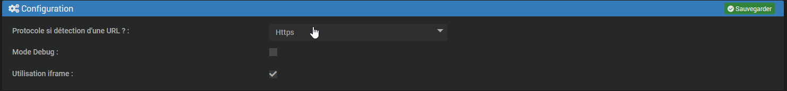

# Suivi Conso Widget

## Présentation

Le plugin Conso Widget permet d'afficher les graphiques de Suivi Conso dans le Dashboard ainsi que dans les designs.

Page de Configuration :

Exemple de graphique :

## Configuration :

La configuration du plugin est extrêmement simple, vous n'avez qu'une seule chose à faire, Il vous suffit de choisir dans la page de configuration si votre accès externe est en https ou en http.

Le case à cocher Mode Debug permet d'afficher des informations pour aider au débuggage en cas de problème.

La case à cocher Utilisation iframe permet de changer de mode de fonctionnement en cas de non affichage sur certains navigateurs (Notamment Safari sur les matériels de la pomme)

# Le plugin ne fonctionnera pas sans sa dépendance principale qui est le plugin Suivi Conso lui-même.

Si les widgets restent vides avec une erreur de connexion, il faut alors paramétrer le paramètre X-Frame-Option dans le serveur Apache. Pour cela aller dans Réglages / Système / Configuration / onglet >_OS/DB / >_ Administration Système : Apache sécurisé

