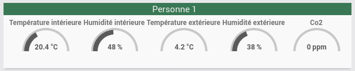
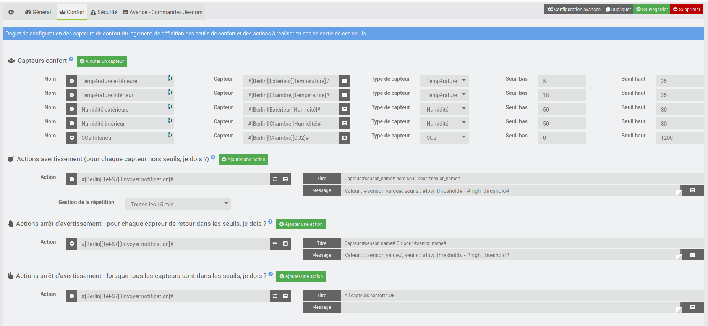
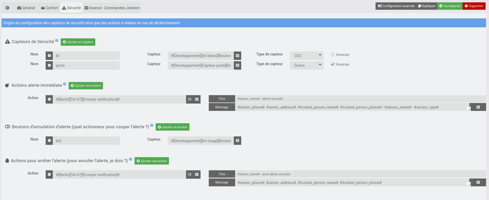
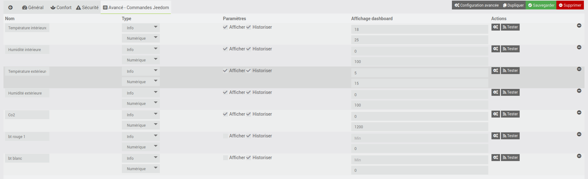

Présentation
============

Ce plugin fait parti d'un ensemble de plugins pour Jeedom permettant l'aide au maintien à domicile des personnes âgées : SeniorCare.

La demande initiale vient de ce sujet sur le forum : [Développer un logiciel d’Analyse comportementale](https://community.jeedom.com/t/developper-un-logiciel-danalyse-comportementale/19111).

Ce plugin permet :
* la surveillance du confort du logement : température, humidité, CO2, …
* de générer des alertes de sécurité (détecteur de fumées, gaz, ...)

Les actions d'alerte peuvent être n'importe quelle action Jeedom : gestion lampe, avertisseur sonore, notification sur smartphone, sms, email, message vocal, ...

Lien vers le code source : [https://github.com/AgP42/seniorcare/](https://github.com/AgP42/seniorcarecomfortsecurity/)

Si vous souhaitez participer au projet, n’hésitez pas à le faire savoir ici [Développer un logiciel d’Analyse comportementale](https://community.jeedom.com/t/developper-un-logiciel-danalyse-comportementale/19111)

Avertissement
==========

Ce plugin a été conçu pour apporter une aide aux personnes âgées ou dépendante et à leurs aidants.
Nous ne pouvons toutefois pas garantir son bon fonctionnement ni qu'un dysfonctionnement de l’équipement domotique n'arrive au mauvais moment.
Merci de l'utiliser en tant que tel et de ne pas prendre de risque pour la santé de ceux que nous cherchons à aider !
Ce plugin est gratuit et open source, il est fourni sans garanti de bon fonctionnement.

Changelog
==========

Voir le [Changelog]((https://superbricolo.github.io/superbricoloDocs/seniorcarecomfortsecurity/fr_FR/changelog)

Seules les modifications ayant un impact fonctionnel sur le plugin sont listées dans le changelog.

Configuration du plugin
========================

Ajouter les différentes personnes à suivre puis, pour chacune, configurer les différents onglets.

Onglet **Général**
---

* **Informations Jeedom**
   * Indiquer le nom de la personne
   * Objet parent : il s'agit de l'objet Jeedom auquel rattacher la personne. Il doit être différent de "Aucun"
   * Activer le plugin pour cette personne
   * Visible sert a visualiser les infos des capteurs sur le dashboard :

(Passer la souris sur la valeur vous donnera sa date de collecte et cliquer dessus affichera son historique)

* **Informations concernant la personne dépendante**
Vous pouvez saisir ici des informations sur la personne dépendante. Ces informations seront utilisées uniquement pour la saisie de tags dans les messages, tous ces champs sont facultatifs.

Onglet **Confort**
---

Cet onglet permet de définir les informations de confort du logement ou extérieur.
Il peut s'agir de la température, du taux d'humidité, du niveau de CO2 (à partir de 1000 ppm, il est recommandé d'aérer le logement) ou autre.

### Configuration

* Définir les différents capteurs de confort du logement à suivre. Il peut s'agit de capteurs de température, d'humidité, de CO2 ou de tout autre type.
  * Vous devez donner un nom unique à chacun de vos capteurs. Attention, le changement de nom d'un capteur revient à le supprimer et a en recréer un nouveau, vous perdez donc l'historique associé.
  * Sélectionner la commande Jeedom du capteur associé. Attention, chaque capteur ne doit être utilisé qu'une seule fois. En cas de nécessité d'utiliser 2 fois la même source, merci de le dupliquer par un virtuel.
  * Définir son type.
  * Définir les seuils haut et bas.
* Définir les actions exécutées pour chaque capteur lors du dépassement de seuil et la gestion voulue pour les répétitions (tant que le capteur est hors seuils)
* Définir (ou non) les actions qui seront exécutées pour chaque capteur lors du retour dans les seuils aprés un dépassement (exécutées à chaque "retour", pour chaque capteur)
* Définir (ou non) les actions à exécuter lorsque tous les capteurs ont leurs valeurs dans les seuils définis

### Tags

Pour les actions avertissement et arrêt d'avertissement (1 capteur), si l'une de vos action est de type "message", vous pouvez utiliser les tags suivants :
  * Tous les tags configuré dans l'onglet "Général" : #senior_name#, #senior_phone#, #senior_address#, #trusted_person_name#, #trusted_person_phone#
  * #sensor_name# : nom du capteur ayant déclenché l'avertissement/arrêt avertissement
  * #sensor_type# : type de ce capteur - attention, le type sera donné en anglais
  * #sensor_value# : valeur courante
  * #low_threshold# : seuil bas défini
  * #high_threshold# : seuil haut défini
  * #unit# : unité correspondant à la valeur

Pour les actions arrêt d'avertissement (tous les capteurs), si l'une de vos action est de type "message", vous pouvez utiliser tous les tags configuré dans l'onglet "Général" : #senior_name#, #senior_phone#, #senior_address#, #trusted_person_name#, #trusted_person_phone#.

### Infos

Détails de fonctionnement :
* Toutes les 15 min, Jeedom évaluera pour chacun des capteurs si sa valeur est dans les seuils définis ou non
* Les actions "Actions avertissement (pour chaque capteur hors seuils, je dois ?)" seront alors exécutées pour chaque capteur hors seuils sauf si l'avertissement a déjà été donné pour ce capteur et que l’utilisateur a choisi de ne pas le répéter
* Lorsqu'un capteur précédemment hors seuil revient dans ses bornes, les actions "Actions arrêt l'avertissement - pour chaque capteur de retour dans les seuils, je dois ?" seront alors exécutées pour ce capteur
* Si tous les capteurs sont évalués "dans les seuils", les actions "Actions arrêt l'avertissement - lorsque tous les capteurs sont dans les seuils, je dois ?" seront alors exécutées. Ces actions seront exécutées toutes les 15 min si tous les capteurs restent dans leurs seuils.

La gestion de la répétition pour les actions d'avertissement permet de limiter la fréquence des messages reçus, par capteur. Ainsi si vous avez 4 capteurs et définissez une gestion de répétition toutes les 6 heures, vous recevrez au maximum 4 alertes toutes les 6 heures. Ceci est remis à 0 à chaque fois que le capteur considéré revient dans ses seuils. Donc pour un capteur oscillant autour d'un seuil, il est possible de recevoir une alerte toutes les 15 min quelque soit la répétition choisie.

Onglet **Sécurité**
---

Cet onglet permet de définir les capteurs de sécurité du logement de la personne dépendante (fumée, fuite de gaz, inondation, …) ainsi que les actions d'alerte à exécuter immédiatement.

### Configuration

* Définir un ou plusieurs capteurs de sécurité. L'alerte sera déclenchée lorsque le capteur passera de l'état 0 à l'état 1. Ou l'inverse si vous cochez la case "Inverser". Vous pouvez activer les logs en mode "Info" et tester vos capteurs pour vous assurer de la bonne prise en compte.
* Définir les actions immédiatement réalisées à l'activation de n'importe lequel de ces capteurs
* Définir un ou plusieurs capteurs de type "bouton" ou "interrupteur" servant à annuler l'alerte
* Définir les actions réalisées à l'activation des capteurs d'annulation

### Tags

Si l'une de vos action est de type "message", vous pouvez utiliser les tags suivants :
  * Tous les tags configuré dans l'onglet "Général" : #senior_name#, #senior_phone#, #senior_address#, #trusted_person_name#, #trusted_person_phone#
  * #sensor_name# : nom du capteur ayant déclenché l'alerte (uniquement pour les actions d'alerte et non annulation d'alerte)
  * #sensor_type# : type de ce capteur - attention, le type sera donné en anglais (uniquement pour les actions d'alerte et non annulation d'alerte)

Onglet **Avancé - Commandes Jeedom**
---

Vous pouvez visualiser dans cet onglet les différentes commandes créées par ce plugin et les configurer

Comportement au démarrage et après redémarrage Jeedom
======

Fonction **Confort**
---
RAS

Fonction **Sécurité**
---
RAS

Remarques générales
===
* Pour les "boutons d'annulation d'alerte de sécurité", c'est le changement de valeur du capteur qui est détecté et déclenche les actions, la valeur en elle-même n'est pas prise en compte. Si le bouton répète constamment la même valeur, il sera considéré à chaque fois.
* Pour les capteurs de "sécurité", l'alerte n'est déclenché qu'au 1er passage de la valeur 0 à 1 (ou inversement si la case "Inverser" est cochée).
* Pour les capteurs "conforts", leur valeur est évaluée toutes les 15 min et non à chaque changement
* Chaque capteur définis dans le plugin doit posséder un nom unique. Le changement de nom d'un capteur revient à le supprimer et à en créer un nouveau, l'historique associé à ce capteur est alors perdu.

Support
===

* Pour toute demande de support ou d'information : [Forum Jeedom](https://community.jeedom.com/c/plugins/security/86)
* Pour un bug ou une demande d'évolution, merci de passer de préférence par [Github](https://github.com/AgP42/seniorcarecomfortsecurity/issues)
